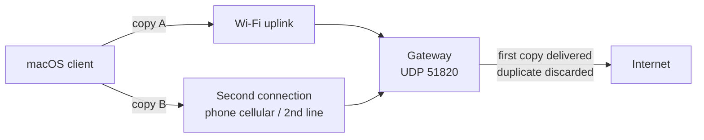

# Gemina VPN

**Keep calls and SSH sessions alive when one network blips — by sending your traffic over two uplinks at once.**

Gemina VPN is a macOS reliability tool. It duplicates your protected traffic
over **two independent connections at once** — your Wi-Fi *and* a second
connection of your choice (your phone's cellular over USB — iPhone or Android — a
second broadband line, or an LTE/USB-Wi-Fi dongle) — sends both copies to a single
gateway, and the gateway delivers the first valid copy while discarding the
duplicate. If one link drops mid-call, the other is already carrying the same
packets, so the session does not notice.

The two connections just need to be **independent** (different paths to the
internet). On macOS, an iPhone or a Pixel/AOSP phone appears as a network
interface natively; other Android phones are driven by the app's bundled
userspace driver — no root on the phone, no kernel extension on the Mac.

This is a **reliability** product, not a bandwidth-aggregation one. It does not
combine the speed of both links; it keeps your connection up. It is open source
and self-hostable, with an optional paid hosted gateway for people who would
rather not run their own server.

> **Status: pre-release.** The dual-path transport is proven end-to-end, but this
> is not yet a shipping VPN. See [Status](#status) below for exactly what is and
> is not done.

## The name

**Gemina** is Latin for *twinned*. When a Roman legion was too depleted to be
sure of holding the line, two were merged into one — a *Legio Gemina*, the twin
legion (Caesar's Tenth and the Thirteenth both bore the name) — so the force
always arrived at full strength. Gemina does the same with your connection: it
sends every packet down two paths at once and keeps whichever copy arrives first,
so you stay online even when one path drops. The same story is in the app's
*About Gemina* dialog, and recorded in [ADR-0008](docs/adr/0008-product-name-gemina.md).

## How it works

The client sends every packet twice — once over each available uplink — tagging
both copies with the same identity. The gateway keeps a short window of recently
seen identities, forwards the first copy of each, and drops any later copy. When
a link fails, its copies simply stop arriving; the surviving link's copies keep
the session going with no reconnection.



Because the two copies travel over genuinely independent networks, a blip on
either one — a tunnel, a lift, a flaky access point — does not interrupt the
flow. The cost is roughly double the data on the protected traffic; the benefit
is continuity.

## Status

This repository is **pre-release**. The dual-path transport has been proven
end-to-end: the same logical packet sent over Wi-Fi and over an Android phone's
cellular link both reach the deployed gateway, are deduplicated to a single
delivery, and either path can drop without ending the session. See the
[*Definition of Dual-Path Success — ACHIEVED*](PROJECT_STATE.md) section of
`PROJECT_STATE.md` for the evidence.

What is **proven**:

* Dual-path duplicate transmission over two independent WANs (Wi-Fi + cellular).
* Server-side deduplication to a single delivery per packet identity.
* Survival of either path dropping mid-session.
* A userspace Android USB tether data plane that needs no root on the phone, no
  kernel extension and no SIP changes on the Mac.

What is **not yet done** (and is therefore not claimed):

* Encryption and real VPN traffic — today's proof carries probe packets, not your
  IP traffic.
* The shipping macOS app data path (the `NEPacketTunnelProvider` integration).
* Accounts, payments and the hosted entitlement flow.

Current state, decisions and the outstanding task list live in:

* [`PROJECT_STATE.md`](PROJECT_STATE.md) — durable cross-session handover.
* [`TASKS.md`](TASKS.md) — the single ordered task list.
* [`DECISIONS.md`](DECISIONS.md) — architectural choices.
* [`docs/product/project-specification.md`](docs/product/project-specification.md) — full product and engineering scope.
* [`AGENTS.md`](AGENTS.md) — working rules for contributors and coding agents.

## Self-host the gateway

The gateway is the server half of the system: a single container that listens on
one UDP port and deduplicates the copies arriving over each client path. There is
nothing to configure beyond the port — no database, no accounts.

```bash
docker run --rm \
  --read-only \
  -p 51820:51820/udp \
  -e GEMINA_GATEWAY_ADDR=:51820 \
  ghcr.io/example/gemina-gateway:latest
```

> Replace `ghcr.io/example/gemina-gateway:latest` with your own image, and
> open **UDP 51820** to the host. Build the image from
> [`deploy/docker/gateway.Dockerfile`](deploy/docker/gateway.Dockerfile).

Then point the client at your gateway by hostname — for example
`gateway.example.com:51820`. **The gateway address is always configurable**; it
is never hard-coded, so self-hosting and the hosted option use the same client.

Full instructions, the available environment variables, and the self-host vs
hosted trade-off are in [`docs/self-hosting.md`](docs/self-hosting.md).

## Use our hosted gateway

If you would rather not run a server, an optional **paid hosted gateway** will be
offered: you point the client at our endpoint and skip the operations entirely.
The client and the gateway remain open source either way — the hosted option only
saves you from running the container yourself.

> **Pricing: TBD.** The hosted tier is not yet available; this is the planned
> commercial model behind the open-source core.

## Compatibility

* **macOS** client. Apple Silicon is the primary target.
* **Any second independent connection** as the second path: your phone's cellular
  over USB (**iPhone** Personal Hotspot and **Pixel/AOSP** phones appear as a
  network interface natively; **other Android** phones are driven by the app's
  bundled userspace driver — no root, no kernel extension, no SIP changes), a
  second broadband line, or an LTE/USB-Wi-Fi dongle.
* No special hardware and no second SIM beyond your normal phone plan.

See the community [`COMPATIBILITY.md`](COMPATIBILITY.md) catalogue, and run
`geminactl preflight -share` to check your own setup and contribute a report.

Run `geminactl preflight` to confirm a given Mac + Android combination is
supported before you commit: it returns a plain verdict (for example *supported*,
*connect your Android*, *connect to Wi-Fi*) and the one thing to change. Add
`-json` for the machine-readable report the app and website consume. The
`geminactl darwin-evidence` diagnostic reports the underlying path evidence.

## Build & test

The repository bootstraps and tests with `make`:

```sh
make bootstrap      # prepare the workspace
make test           # Go + macOS + docs checks
make lint           # formatting and static analysis
make licence-check  # licence/provenance gate
```

`make fetch-research` clones pinned upstream sources into a Git-ignored
`.research-src/` for due diligence only; it must never copy upstream
implementation files into product directories. See the `Makefile` for the full
set of targets.

## Source rules

* Do not copy GPL implementation code into product directories.
* Engarde and OpenMPTCProuter are inspiration-only.
* WireGuard Apple and wireguard-go are permitted foundations, subject to retained
  notices and provenance records.
* Do not invent cryptography.
* Do not log secrets or store raw access keys.

## Licence

This project is dual-licensed (open-core):

* The **gateway/server** is **AGPL-3.0-only** — `cmd/gateway/`,
  `internal/gateway/`, and gateway-only server assets under `deploy/`.
* The **client and shared core** are **Apache-2.0** — `apps/macos/`, the `pkg/`
  packages, `cmd/geminactl/`, and the shared `internal/` packages.

The AGPL keeps the hosted gateway open; the client stays Apache-2.0 so it can
ship on the Mac App Store, which cannot carry AGPL software. Apache-2.0 is
one-way compatible into AGPL-3.0, so the gateway may include the core but the
client must never include gateway code.

Full texts: [`LICENSES/AGPL-3.0.txt`](LICENSES/AGPL-3.0.txt) and
[`LICENSES/Apache-2.0.txt`](LICENSES/Apache-2.0.txt). The directory map and
rationale are in [`docs/legal/licensing.md`](docs/legal/licensing.md); see also
[`LICENSE`](LICENSE) and [`NOTICE`](NOTICE). Third-party material, if ever
imported, retains its original licence and attribution as recorded under
`docs/legal/`.
